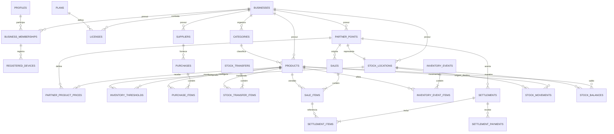

# Modelo de dados da V1 — Maria Controla

**Status:** proposta detalhada em revisão. Este documento ainda não cria tabelas nem migrações SQL.

## 1. Objetivo

Definir o modelo lógico do banco central da V1, preservando isolamento entre negócios, rastreabilidade das mercadorias, operação offline, preços históricos e acertos parciais.

O modelo deve permitir responder com segurança:

- o que entrou;
- onde cada mercadoria está;
- o que foi enviado, vendido, devolvido, perdido ou ajustado;
- qual preço foi usado em cada venda;
- quanto está pendente com cada Ponto Parceiro;
- quanto foi acordado e quanto foi pago;
- quais operações ainda estão somente no aparelho;
- quais divergências precisam de conferência.

## 2. Convenções propostas

Estas convenções deverão ser transformadas em tipos, chaves e restrições no lote de SQL:

- identificadores de negócio, cadastros, operações e comandos serão UUIDs geráveis também no aparelho;
- toda entidade pertencente a cliente terá `business_id`;
- valores monetários serão armazenados em centavos inteiros, evitando arredondamento de ponto flutuante;
- datas técnicas serão armazenadas em UTC; a data de ocorrência será preservada separadamente da data de sincronização;
- entidades editáveis terão `version`, incrementada a cada alteração confirmada;
- cadastros referenciados por histórico serão arquivados, não apagados;
- operações confirmadas não serão editadas ou apagadas; correções ocorrerão por estorno ou ajuste vinculado;
- quantidades deverão ser positivas nos itens; o sentido será determinado pela operação ou pelas localizações de origem e destino;
- tabelas expostas terão Row Level Security e permissões explícitas;
- relacionamentos entre dados do cliente deverão validar também o mesmo `business_id`.

Os nomes técnicos em inglês são provisórios. A interface continuará em português e com a linguagem aprovada do produto.

## 3. Visão geral dos relacionamentos

## 4. Plataforma, clientes e acesso

### `businesses`

Representa cada cliente pagante e é a raiz do isolamento dos dados.

Campos lógicos principais:

- `id`;
- `name`;
- `support_code`, público, curto e único para suporte;
- `status`: teste, ativo, vencido, bloqueado ou cancelado;
- `timezone`, inicialmente `America/Sao_Paulo`;
- `created_at`, `updated_at`, `archived_at`;
- `version`.

Regras:

- um negócio recebe uma localização própria ao ser criado;
- produtos, custos, preços e operações nunca são compartilhados com outro negócio;
- o código de suporte não substitui o UUID interno.

### `profiles`

Complementa o usuário mantido pelo Supabase Auth.

Campos:

- `user_id`, igual ao identificador do Auth;
- `full_name`;
- `username` e `username_normalized`;
- `phone_whatsapp`, opcional;
- `status`: ativo, bloqueado ou inativo;
- `created_at`, `updated_at`;
- `version`.

Regras:

- o e-mail verificado e a senha permanecem sob responsabilidade do Auth;
- a regra de unicidade global ou por negócio do nome de usuário será definida antes do SQL;
- CPF, data de nascimento e endereço não entram na V1.

### `business_memberships`

Relaciona usuário e negócio.

Campos:

- `id`, `business_id`, `user_id`;
- `role`: owner, admin ou operator;
- `status`: invited, active, blocked ou inactive;
- `joined_at`, `created_at`, `updated_at`;
- `version`.

Regras:

- na V1, um usuário ativo pertence a um negócio;
- o vínculo, e não um valor enviado pela interface, determina o `business_id` permitido;
- somente owner ou admin poderá gerenciar usuários internos, conforme permissões futuras.

### `plans`

Mantém configurações comerciais sem fixar os valores agora.

Campos:

- `id`, `name`, `status`;
- `max_users`, `max_devices`, `max_partner_points`, todos configuráveis;
- `features`, conjunto versionado de capacidades;
- `created_at`, `updated_at`, `version`.

### `licenses`

Registra o direito de uso de um negócio.

Campos:

- `id`, `business_id`, `plan_id`;
- `status`: trial, active, grace, blocked ou cancelled;
- `starts_at`, `expires_at`, `grace_until`;
- limites sobrescritos opcionais;
- observação administrativa;
- `created_at`, `updated_at`, `version`.

Regras:

- ações de escrita no servidor consultam a licença vigente;
- a forma de cobrança não faz parte desta tabela na V1;
- alterações de licença exigem internet e permissão da plataforma.

### `registered_devices`

Representa uma instalação reconhecida para controle comercial e suporte.

Campos:

- `id`, `business_id`, `membership_id`;
- `installation_id`, gerado pela PWA;
- nome amigável e informações resumidas do navegador/dispositivo;
- `status`: pending, active, released ou blocked;
- `first_seen_at`, `last_seen_at`, `released_at`;
- `created_at`, `updated_at`, `version`.

O comportamento exato ao atingir o limite permanece configurável até a decisão comercial.

## 5. Catálogo e parceiros

### `category_templates`

Lista mantida pela plataforma somente para criar categorias iniciais em novos negócios.

Campos: `id`, `name`, `display_order`, `active`, `created_at`, `updated_at`.

As operações do cliente não referenciam diretamente esta tabela. Os modelos são copiados para `categories` durante a criação do negócio.

### `categories`

Campos:

- `id`, `business_id`, `name`, `normalized_name`;
- `origin`: template ou custom;
- `active`, `display_order`;
- `created_at`, `updated_at`, `archived_at`, `version`.

Regra: nome ativo não se repete dentro do mesmo negócio após normalização.

### `products`

Campos:

- `id`, `business_id`, `category_id` opcional;
- `name`, `normalized_name`;
- `unit`, inicialmente unidade;
- `default_sale_price_cents` opcional;
- `photo_path` opcional;
- `notes`;
- `active`;
- `created_at`, `updated_at`, `archived_at`, `version`.

Regras:

- cada tamanho, cor ou modelo relevante é um produto separado na V1;
- custo não é um único valor atual do produto; o histórico de custo fica nos itens de compra;
- produto com histórico é arquivado, não apagado.

### `suppliers`

Campos:

- `id`, `business_id`, `name`, `normalized_name`;
- `phone_whatsapp`, `location_text`, `notes`;
- `active`, datas de auditoria e `version`.

### `partner_points`

Campos:

- `id`, `business_id`, `name`, `normalized_name`;
- responsável, telefone/WhatsApp e observações;
- `status`: active ou inactive;
- `created_at`, `updated_at`, `archived_at`, `version`.

Regras:

- cada Ponto Parceiro possui exatamente uma localização de estoque;
- o parceiro não possui usuário de acesso na V1;
- desativar o parceiro não apaga estoque, vendas ou acertos.

### `stock_locations`

Unifica onde a mercadoria pode estar.

Campos:

- `id`, `business_id`;
- `type`: own ou partner;
- `name`;
- `partner_point_id` obrigatório somente para tipo partner;
- `active`;
- datas de auditoria e `version`.

Regras:

- existe uma localização own principal por negócio na V1;
- uma localização de parceiro pertence ao mesmo negócio do Ponto Parceiro;
- origem e destino de uma transferência devem ser diferentes.

### `partner_product_prices`

Campos:

- `id`, `business_id`, `partner_point_id`, `product_id`;
- `sale_price_cents`;
- `active`, datas de auditoria e `version`.

Regra: apenas um preço ativo por produto e parceiro. Sem registro ativo, usa-se o preço padrão do produto.

### `inventory_thresholds`

Campos:

- `id`, `business_id`, `product_id`, `stock_location_id`;
- `minimum_quantity`;
- datas de auditoria e `version`.

Regra: combinação única de produto e localização. A ausência significa que não há mínimo configurado naquele local.

## 6. Operações de mercadoria

Todas as operações confirmadas guardam `business_id`, `occurred_at`, `recorded_by`, `device_id`, `command_id`, `created_at` e eventual referência de estorno.

### `purchases` e `purchase_items`

Cabeçalho:

- `id`, `business_id`, `supplier_id`, `occurred_at`, `notes`;
- `status`: confirmed ou reversed;
- dados comuns de auditoria e sincronização.

Item:

- `id`, `business_id`, `purchase_id`, `product_id`;
- `quantity`, `unit_cost_cents`, `total_cost_cents`;
- `destination_location_id`, que deve ser a localização própria na V1.

Efeito: cria entrada no estoque próprio e preserva fornecedor, quantidade e custo daquele momento.

### `stock_transfers` e `stock_transfer_items`

Usadas para envio e devolução entre estoque próprio e Ponto Parceiro.

Cabeçalho:

- `id`, `business_id`;
- `transfer_type`: send_to_partner ou return_from_partner;
- `source_location_id`, `destination_location_id`, `partner_point_id`;
- `occurred_at`, `notes`, `status` e auditoria.

Item:

- `id`, `business_id`, `stock_transfer_id`, `product_id`, `quantity`.

Efeito: uma transferência reduz a origem e aumenta o destino na mesma quantidade, dentro da mesma transação.

### `sales` e `sale_items`

Cabeçalho:

- `id`, `business_id`;
- `sale_channel`: direct ou partner;
- `source_location_id`;
- `partner_point_id`, obrigatório para partner e vazio para direct;
- `occurred_at`, `notes`, `status` e auditoria.

Item:

- `id`, `business_id`, `sale_id`, `product_id`;
- `quantity`;
- `suggested_unit_price_cents`, preço encontrado no momento do lançamento;
- `unit_price_cents`, preço efetivamente usado;
- `total_amount_cents`;
- `price_source`: product_default, partner_override ou manual.

Efeitos:

- venda direta reduz o estoque próprio e não gera pendência com parceiro;
- venda em parceiro reduz o estoque da localização do parceiro e gera valor elegível para acerto;
- alteração futura de preço não modifica itens vendidos.

### `inventory_events` e `inventory_event_items`

Representam perda, avaria e ajuste manual sem confundir esses fatos com venda ou devolução.

Cabeçalho:

- `id`, `business_id`;
- `event_type`: loss, damage, increase_adjustment ou decrease_adjustment;
- `stock_location_id`, `occurred_at`;
- motivo obrigatório para ajustes e observação opcional;
- `status` e auditoria.

Item:

- `id`, `business_id`, `inventory_event_id`, `product_id`, `quantity`.

Efeito: perda, avaria e redução retiram saldo; aumento adiciona saldo. Ajustes nunca apagam o movimento que causou a divergência.

### Anexos opcionais

Fotos e comprovantes poderão usar uma tabela `attachments` com:

- `id`, `business_id`;
- tipo e identificador da entidade de origem;
- caminho privado no Storage;
- nome, tipo MIME, tamanho e hash;
- situação de upload;
- datas e usuário responsável.

O arquivo binário não ficará no PostgreSQL. O detalhamento poderá esperar o lote em que fotos forem implementadas.

## 7. Estoque e rastreabilidade

### `stock_movements`

É a fonte de verdade histórica para saldo.

Campos:

- `id`, `business_id`, `product_id`;
- `movement_type`: purchase, transfer, return, direct_sale, partner_sale, loss, damage, adjustment ou reversal;
- `source_location_id` opcional;
- `destination_location_id` opcional;
- `quantity`, sempre positiva;
- tipo e identificadores da operação e do item de origem;
- `occurred_at`, `recorded_by`, `device_id`, `command_id`;
- `reversal_of_movement_id` opcional;
- `created_at`.

Restrições:

- ao menos origem ou destino deve existir;
- origem e destino não podem ser iguais;
- produto e localizações pertencem ao mesmo negócio;
- movimento confirmado não recebe update ou delete;
- estorno cria movimento inverso e referencia o original;
- um item de operação não pode gerar o mesmo movimento duas vezes.

### `stock_balances`

Projeção para leitura rápida, não fonte histórica.

Campos:

- `business_id`, `product_id`, `stock_location_id`;
- `confirmed_quantity`;
- `version`, `updated_at`.

Regras:

- combinação única de produto e localização;
- alteração ocorre na mesma transação que cria o movimento;
- o saldo pode ser recalculado pela soma de `stock_movements`;
- saldo negativo é permitido somente para preservar um fato offline concorrente e deve gerar conflito visível.

## 8. Acertos e pagamentos parciais

### `settlements`

Representa a conferência financeira com um Ponto Parceiro.

Campos:

- `id`, `business_id`, `partner_point_id`;
- período opcional de referência;
- `calculated_amount_cents`;
- `agreed_amount_cents`;
- `difference_amount_cents`;
- `difference_reason` opcional;
- `paid_amount_cents`, projeção da soma dos pagamentos;
- `status`: open, partially_paid, paid ou reversed;
- `occurred_at`, auditoria e sincronização.

### `settlement_items`

Vincula o acerto às vendas que lhe deram origem.

Campos:

- `id`, `business_id`, `settlement_id`, `sale_item_id`;
- `quantity_considered`;
- `calculated_amount_cents`;
- `agreed_amount_cents`;
- datas de auditoria.

Regras:

- uma venda pode participar de mais de um acerto até que sua quantidade e seu valor estejam integralmente tratados;
- a soma considerada nunca pode exceder a venda sem gerar conflito;
- a distribuição de uma diferença do cabeçalho entre itens será automática, mas a regra exata será definida na implementação do fluxo;
- o vínculo com a venda nunca é apagado após pagamento.

### `settlement_payments`

Permite pagamento parcial.

Campos:

- `id`, `business_id`, `settlement_id`;
- `amount_cents`, `paid_at`;
- `payment_method` opcional;
- `notes`;
- `status`: confirmed ou reversed;
- auditoria e sincronização.

Regras:

- pagamentos confirmados somados definem `paid_amount_cents`;
- valor inferior ao acordado mantém o acerto partially_paid;
- valor igual ao acordado torna o acerto paid;
- eventual valor superior exige confirmação ou conflito, nunca ajuste silencioso;
- correção de pagamento ocorre por estorno, não por exclusão.

## 9. Sincronização, conflitos e auditoria no banco central

### `sync_commands`

Caixa de entrada idempotente dos comandos enviados pelos aparelhos.

Campos:

- `id`, UUID gerado no aparelho e usado como chave de idempotência;
- `business_id`, `user_id`, `device_id`;
- `device_sequence`, crescente dentro da instalação;
- `command_type`, `payload_version`, `payload`;
- `occurred_at`, `received_at`, `processed_at`;
- `status`: received, processing, accepted, conflict ou rejected;
- entidade criada ou afetada;
- código e mensagem segura de resultado.

Regra: receber novamente o mesmo `id` devolve o resultado anterior, sem repetir a operação.

### `sync_conflicts`

Campos:

- `id`, `business_id`, `command_id`;
- `conflict_type`: negative_stock, stale_version, invalid_reference, exceeded_allocation ou outro controlado;
- entidade e registro afetado;
- resumo local e resumo do servidor sem segredo;
- `status`: open, acknowledged ou resolved;
- `resolution_type`, `resolution_operation_id`, `resolved_by`, `resolved_at`;
- datas de auditoria.

### `change_log`

Feed durável para aparelhos buscarem mudanças ocorridas em outros dispositivos.

Campos:

- `sequence`, crescente no servidor;
- `business_id`;
- tipo e identificador da entidade;
- `change_type`: upsert, archive ou event;
- `entity_version`;
- `changed_at`.

O aparelho guarda o último `sequence` aplicado e busca apenas mudanças posteriores. Tempo do relógio do celular não será usado como cursor.

### `audit_events`

Registra ações administrativas e alterações relevantes que não são movimentos de estoque.

Campos:

- `id`, `business_id` opcional;
- ator, ação, entidade, registro e metadados mínimos;
- `occurred_at`, endereço ou contexto técnico quando necessário.

Não deve armazenar senha, token ou conteúdo sensível desnecessário.

## 10. Matriz de origem dos saldos e valores

| Informação exibida | Fonte de verdade | Projeção permitida |
|---|---|---|
| Estoque por produto e local | `stock_movements` | `stock_balances` |
| Último custo e fornecedor | `purchase_items` + `purchases` | consulta ou resumo derivado |
| Preço padrão | `products` | cópia local |
| Preço do parceiro | `partner_product_prices` | cópia local |
| Preço histórico da venda | `sale_items.unit_price_cents` | não substituir |
| Vendido ainda não tratado em acerto | vendas em parceiro menos itens de acerto | resumo por parceiro |
| Valor acordado | `settlements` e `settlement_items` | resumo por parceiro |
| Valor pago | `settlement_payments` | `settlements.paid_amount_cents` |
| Pendência de sincronização | caixa local `outbox` | contador visual |
| Divergência | `sync_conflicts` | alerta na Home |

## 11. Fluxos de validação do modelo

### Compra

1. cria `purchase` e seus itens;
2. cria movimento com destino ao estoque próprio;
3. atualiza o saldo confirmado;
4. publica mudanças no `change_log`.

### Envio ao parceiro

1. cria transferência own → partner;
2. cria movimento com origem e destino;
3. reduz saldo próprio e aumenta saldo do parceiro atomicamente.

### Venda no parceiro

1. encontra preço do parceiro ou preço padrão;
2. permite edição e salva preço efetivo no item;
3. cria movimento de saída da localização do parceiro;
4. deixa o item elegível para acerto.

### Venda direta

1. usa a localização própria como origem;
2. cria movimento de saída;
3. não cria pendência com Ponto Parceiro.

### Devolução

1. cria transferência partner → own;
2. reduz o saldo do parceiro e aumenta o próprio na mesma transação.

### Acerto parcial

1. reúne vendas ainda não totalmente tratadas;
2. calcula o valor e permite registrar valor acordado diferente;
3. preserva os itens de venda vinculados;
4. recebe um ou mais pagamentos;
5. mantém status partially_paid até completar o valor acordado.

### Conflito offline

1. servidor recebe comando idempotente;
2. preserva o fato operacional válido;
3. se o resultado gerar saldo negativo ou versão concorrente, cria `sync_conflict`;
4. Cliente 1 recebe alerta;
5. resolução cria ajuste, estorno ou confirmação rastreável.

## 12. Itens deliberadamente não fechados neste lote

- nomes físicos finais, tipos SQL, índices e políticas RLS;
- unicidade global ou por negócio do nome de usuário;
- números dos limites comerciais;
- bloqueio ou tolerância ao exceder dispositivos;
- valores e forma de cobrança;
- retenção e exclusão após cancelamento;
- regra visual de distribuição da diferença de um acerto entre seus itens;
- anexos e fotos além da estrutura conceitual.

Esses pontos não impedem o modelo lógico. Os que afetam SQL deverão ser resolvidos ou mantidos configuráveis no próximo lote.

## 13. Critérios de aprovação

- cada dado do cliente possui vínculo inequívoco com o negócio;
- produto, categoria, preço e estoque não vazam entre clientes;
- toda entrada e saída gera movimento rastreável;
- transferência movimenta origem e destino atomicamente;
- venda direta e venda em parceiro têm efeitos diferentes;
- preço histórico da venda não depende do cadastro atual;
- pagamentos parciais não apagam a origem da pendência;
- saldo pode ser reconstruído pelo histórico;
- comandos repetidos não duplicam operações;
- conflitos offline permanecem visíveis até resolução;
- o modelo pode ser traduzido em migrações PostgreSQL e estruturas IndexedDB no lote seguinte.
